# Higgs — Architecture Diagram

```mermaid
%%{init: {"theme": "dark", "themeVariables": {"fontSize": "13px"}}}%%
graph TD

    %% ── USER ──────────────────────────────────────────────────────────────
    USER(["👤 User"])

    %% ── WIDGET LAYER ──────────────────────────────────────────────────────
    subgraph WIDGET["🖼  Widget Layer  (PyQt6 — always-on-top desktop window)"]
        direction LR
        OVL["overlay.py\nDesktop widget\n(orb / Pokémon sprite)"]
        CHAT["chat_panel.py\nChat UI"]
        SETT["settings_panel.py\nSettings UI"]
        NOTIF["notifications.py\nToast popups"]
        CHAR["characters/\npokemon_character.py\nSprite & mood animation"]
    end

    %% ── ORCHESTRATOR ──────────────────────────────────────────────────────
    subgraph MAIN["⚙  Orchestrator  (main.py)"]
        direction LR
        QT["QTimer\nPeriodic scan\n(30 s)"]
        TPE["ThreadPoolExecutor\n4 workers"]
        SIG["Qt Signals / Slots\nScanSignals\nContextSignals\nSchedulerSignals"]
        WINMON["WindowMonitor\nWindow-change events"]
    end

    %% ── AWARENESS LAYER ───────────────────────────────────────────────────
    subgraph AWARE["👁  Awareness Layer  (awareness/)"]
        direction TB
        subgraph SYS_GROUP["System"]
            SYS["system.py\nCPU · RAM · Disk"]
            WIN["windows.py\nForeground window\nWin32 GetForegroundWindow"]
            APPS["apps.py\nInstalled app list"]
        end
        subgraph DOC_GROUP["Document Reading"]
            OFF["office_reader.py\nExcel · Word · PPT\nWin32 COM (no add-in)"]
            BRW["browser_reader.py\nChrome / Edge tab\nDevTools Protocol (CDP)"]
        end
        subgraph VAULT_GROUP["Knowledge"]
            NOTES["notes.py\nObsidian notes"]
            TASKS["tasks.py\nObsidian tasks"]
            CTX["context_detector.py\nLocal context rules\n(PDF / code / language)"]
        end
    end

    %% ── BRAIN LAYER ───────────────────────────────────────────────────────
    subgraph BRAIN["🧠  Brain Layer  (brain/)"]
        direction TB
        CTXB["context.py\nAssembles full\ncontext string"]
        AZ["azure_client.py\nGPT-4o scan · chat\nSchedule probe / finalize"]
        MEM["memory.py\nObservations\nRecommendation history"]
        PAT["pattern_analyzer.py\nDaily pattern summary\nTriggers soul evolution"]
        SOUL["soul_builder.py\nRead-into-being\nSeed · Evolve · Reset"]
        SCHED["scheduler.py\nCalendar events\nNLP scheduling (2-turn)"]
        FLASK["api_server.py\nFlask REST bridge\nlocalhost:5050"]
    end

    %% ── DATA LAYER ────────────────────────────────────────────────────────
    subgraph DATA["💾  Data Layer"]
        direction LR
        DB[("companion.db\nSQLite\nobservations\nrecommendations\ncalendar_events")]
        SOUL_FILES["memory/\nsoul.md\nidentity.md\nmemory.md\nprocedures.md\nsalience.md"]
        CFG["config.json\nAzure creds\nSkill toggles\nIdentity"]
        VAULT_FS["Obsidian Vault\n.md files"]
    end

    %% ── EXTERNAL SERVICES ─────────────────────────────────────────────────
    subgraph EXT["☁  External"]
        direction LR
        GPT["Azure OpenAI\nGPT-4o\ngpt-4o deployment"]
        OFFICE_APP["Microsoft Office\nExcel · Word · PPT\n(running process)"]
        BROWSER_APP["Chrome / Edge\n--remote-debugging-port=9222"]
    end

    %% ── FLOWS ─────────────────────────────────────────────────────────────

    %% User ↔ Widget
    USER -- "clicks / types" --> CHAT
    USER -- "right-click menu" --> OVL
    USER -- "opens" --> SETT
    OVL -- "displays mood + headline" --> USER
    NOTIF -- "toast notification" --> USER

    %% Widget → Orchestrator
    CHAT -- "chat message" --> MAIN
    SETT -- "config saved" --> CFG
    OVL -- "Qt events" --> MAIN

    %% Orchestrator → Awareness + Brain
    QT -- "every 30 s" --> TPE
    WINMON -- "window changed" --> SIG
    SIG -- "triggers scan" --> TPE
    TPE -- "run_scan()" --> CTXB
    TPE -- "run_context_check()" --> CTX
    TPE -- "run_chat()" --> AZ
    TPE -- "scheduler check 60 s" --> SCHED

    %% Awareness → Context Builder
    WIN --> CTXB
    SYS --> CTXB
    APPS --> CTXB
    OFF -- "Excel / Word / PPT content" --> CTXB
    BRW -- "tab URL + page text" --> CTXB
    NOTES --> CTXB
    TASKS --> CTXB
    CTX --> CTXB
    MEM -- "memory context\n(7-day history)" --> CTXB

    %% Context Builder → Azure AI
    CTXB -- "assembled context string" --> AZ

    %% Soul → Azure (injected at top of every prompt)
    SOUL -- "soul context block\n(~400 tokens)" --> AZ

    %% Azure → GPT-4o
    AZ -- "POST chat/completions" --> GPT
    GPT -- "JSON response\n{mood, headline, message}" --> AZ

    %% Azure → Memory + Soul
    AZ -- "save recommendation" --> MEM
    AZ -- "append_memory()" --> SOUL_FILES

    %% Memory → Pattern → Soul evolution
    MEM -- "daily observations" --> PAT
    PAT -- "evolve() once/day" --> SOUL
    SOUL -- "reads/writes" --> SOUL_FILES

    %% AI result → Widget
    AZ -- "scan result" --> SIG
    SIG -- "set_mood()\nshow_notification()" --> OVL
    SIG -- "chat reply" --> CHAT
    SCHED -- "15-min warning\nstart notification" --> SIG

    %% Flask bridge (VBA add-in → backend)
    FLASK -- "receives Excel selection\n/api/excel/selection" --> AZ
    FLASK -- "serves addin/\nHTML + JS" --> USER

    %% Data reads/writes
    MEM -- "SQLite R/W" --> DB
    SCHED -- "SQLite R/W" --> DB
    AZ -- "reads config" --> CFG
    NOTES -- "reads vault" --> VAULT_FS
    TASKS -- "reads vault" --> VAULT_FS

    %% COM + CDP connections
    OFF -- "GetActiveObject()\nWin32 COM" --> OFFICE_APP
    BRW -- "HTTP + WebSocket\nport 9222" --> BROWSER_APP

    %% ── STYLES ────────────────────────────────────────────────────────────
    classDef layer fill:#161b22,stroke:#30363d,color:#e6edf3
    classDef ext  fill:#0d2137,stroke:#4a9eff,color:#79c0ff
    classDef data fill:#0d2a1a,stroke:#3fb950,color:#3fb950
    classDef ai   fill:#1f1235,stroke:#bc8cff,color:#d2a8ff

    class WIDGET,MAIN,AWARE,BRAIN layer
    class EXT,GPT,OFFICE_APP,BROWSER_APP ext
    class DATA,DB,SOUL_FILES,CFG,VAULT_FS data
    class AZ,SOUL,PAT ai
```



---

## Layer Summary

| Layer | Files | Responsibility |
|---|---|---|
| **Widget** | `overlay.py`, `chat_panel.py`, `settings_panel.py`, `notifications.py`, `characters/` | PyQt6 desktop UI — always-on-top frameless window, mood animations, chat, settings |
| **Orchestrator** | `main.py` | Qt timers, `ThreadPoolExecutor`, signals/slots — wires all layers together |
| **Awareness** | `awareness/` | Collects live context: system metrics, active window, Office docs (COM), browser (CDP), Obsidian vault |
| **Brain** | `brain/` | Assembles context, calls Azure GPT-4o, manages memory, evolves soul, runs scheduler |
| **Data** | `companion.db`, `memory/*.md`, `config.json` | SQLite for observations/recommendations/events; Markdown soul files; JSON config |
| **External** | Azure OpenAI, Office COM, Chrome CDP | GPT-4o inference; native Office document access; browser tab reading |

## Key Data Flows

```
Scan cycle (every 30 s or on window change):
  Awareness layer ──► context.py assembles string
                        + soul_builder injects soul block
                      ──► azure_client sends to GPT-4o
                      ──► result → mood animation + notification
                      ──► observation saved to SQLite

Chat cycle (user types in chat panel):
  User message ──► NLP scheduler check
                    if schedule intent  → 2-turn probe/finalize → calendar_events table
                    else               → azure_client.chat() → reply shown in chat panel

Daily evolution (once per day, after pattern summary):
  SQLite observations ──► pattern_analyzer ──► soul_builder.evolve()
                                               ──► GPT-4o rewrites soul.md
                                               ──► next scan picks up new soul
```
